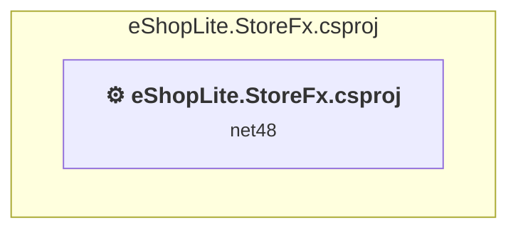

# src\eShopLite.StoreFx\eShopLite.StoreFx.csproj

[← Back to the assessment index](../../assessment.md)

## Project Info

- **Current Target Framework:** net48
- **Proposed Target Framework:** net10.0
- **SDK-style**: False
- **Project Kind:** Wap
- **Dependencies**: 0
- **Dependants**: 0
- **Number of Files**: 106
- **Number of Files with Incidents**: 12
- **Lines of Code**: 1849
- **Estimated LOC to modify**: 259+ (at least 14.0% of the project)

## Dependency Graph

Legend:
📦 SDK-style project
⚙️ Classic project

## API Compatibility

| Category | Count | Impact |
| :--- | :---: | :--- |
| 🔴 Binary Incompatible | 207 | High - Require code changes |
| 🟡 Source Incompatible | 52 | Medium - Needs re-compilation and potential conflicting API error fixing |
| 🔵 Behavioral change | 0 | Low - Behavioral changes that may require testing at runtime |
| ✅ Compatible | 1076 |  |
| ***Total APIs Analyzed*** | ***1335*** |  |

## NuGet Package Issues

| Package | Current Version | Suggested Version | Severity | Issue |
| :--- | :---: | :---: | :---: | :--- |
| Autofac.Mvc5 | 6.1.0 | — | 🔴 Mandatory | NuGet package is incompatible |
| EntityFramework | 6.5.1 | 6.5.2 | 🟡 Potential | NuGet package upgrade is recommended |
| Microsoft.AspNet.Mvc | 5.3.0 | — | 🔴 Mandatory | NuGet package functionality is included with framework reference |
| Microsoft.AspNet.Razor | 3.3.0 | — | 🔴 Mandatory | NuGet package functionality is included with framework reference |
| Microsoft.AspNet.WebPages | 3.3.0 | — | 🔴 Mandatory | NuGet package functionality is included with framework reference |
| Microsoft.Bcl.AsyncInterfaces | 9.0.7 | 10.0.12 | 🟡 Potential | NuGet package upgrade is recommended |
| Microsoft.CodeDom.Providers.DotNetCompilerPlatform | 4.1.0 | — | 🔴 Mandatory | NuGet package functionality is included with framework reference |
| Microsoft.Web.Infrastructure | 2.0.0 | — | 🔴 Mandatory | NuGet package functionality is included with framework reference |
| Newtonsoft.Json | 13.0.3 | 13.0.4 | 🟡 Potential | NuGet package upgrade is recommended |
| System.Buffers | 4.6.1 | — | 🔴 Mandatory | NuGet package functionality is included with framework reference |
| System.Diagnostics.DiagnosticSource | 9.0.7 | 10.0.12 | 🟡 Potential | NuGet package upgrade is recommended |
| System.Memory | 4.6.3 | — | 🔴 Mandatory | NuGet package functionality is included with framework reference |
| System.Numerics.Vectors | 4.6.1 | — | 🔴 Mandatory | NuGet package functionality is included with framework reference |
| System.Threading.Tasks.Extensions | 4.6.3 | — | 🔴 Mandatory | NuGet package functionality is included with framework reference |

Every project affected by these packages, and the versions the repository settles on: [aggregate NuGet packages](../nuget/aggregate-packages.md).

## Binding Redirect Configuration

| Rule | Severity | Details | Recommendation |
| :--- | :---: | :--- | :--- |
| Manual redirect conflicts with auto-generated version | 🔴 Mandatory | Manual redirect for Newtonsoft.Json targets 13.0.0.0 but auto-generation would target 13.0.3 (MSB3836 conflict) | Remove the conflicting manual binding redirect or disable auto-generation. |
| Manual redirect conflicts with auto-generated version | 🔴 Mandatory | Manual redirect for System.Memory targets 4.0.5.0 but auto-generation would target 4.6.3 (MSB3836 conflict) | Remove the conflicting manual binding redirect or disable auto-generation. |
| Manual redirect conflicts with auto-generated version | 🔴 Mandatory | Manual redirect for System.Threading.Tasks.Extensions targets 4.2.4.0 but auto-generation would target 4.6.3 (MSB3836 conflict) | Remove the conflicting manual binding redirect or disable auto-generation. |
| Manual redirect conflicts with auto-generated version | 🔴 Mandatory | Manual redirect for Microsoft.Bcl.AsyncInterfaces targets 9.0.0.7 but auto-generation would target 9.0.7 (MSB3836 conflict) | Remove the conflicting manual binding redirect or disable auto-generation. |
| Manual redirect conflicts with auto-generated version | 🔴 Mandatory | Manual redirect for System.Runtime.CompilerServices.Unsafe targets 6.0.3.0 but auto-generation would target 6.1.2 (MSB3836 conflict) | Remove the conflicting manual binding redirect or disable auto-generation. |
| Manual redirect conflicts with auto-generated version | 🔴 Mandatory | Manual redirect for System.Buffers targets 4.0.5.0 but auto-generation would target 4.6.1 (MSB3836 conflict) | Remove the conflicting manual binding redirect or disable auto-generation. |
| Manual redirect conflicts with auto-generated version | 🔴 Mandatory | Manual redirect for System.Diagnostics.DiagnosticSource targets 9.0.0.7 but auto-generation would target 9.0.7 (MSB3836 conflict) | Remove the conflicting manual binding redirect or disable auto-generation. |
| Binding redirect forces version downgrade | 🟡 Potential | Binding redirect for Microsoft.Bcl.AsyncInterfaces targets 9.0.0.7 but package provides 9.0.7 | Update the binding redirect newVersion to match the version provided by the NuGet package. |
| Binding redirect forces version downgrade | 🟡 Potential | Binding redirect for Newtonsoft.Json targets 13.0.0.0 but package provides 13.0.3 | Update the binding redirect newVersion to match the version provided by the NuGet package. |
| Binding redirect forces version downgrade | 🟡 Potential | Binding redirect for System.Buffers targets 4.0.5.0 but package provides 4.6.1 | Update the binding redirect newVersion to match the version provided by the NuGet package. |
| Binding redirect forces version downgrade | 🟡 Potential | Binding redirect for System.Diagnostics.DiagnosticSource targets 9.0.0.7 but package provides 9.0.7 | Update the binding redirect newVersion to match the version provided by the NuGet package. |
| Binding redirect forces version downgrade | 🟡 Potential | Binding redirect for System.Memory targets 4.0.5.0 but package provides 4.6.3 | Update the binding redirect newVersion to match the version provided by the NuGet package. |
| Binding redirect forces version downgrade | 🟡 Potential | Binding redirect for System.Runtime.CompilerServices.Unsafe targets 6.0.3.0 but package provides 6.1.2 | Update the binding redirect newVersion to match the version provided by the NuGet package. |
| Binding redirect forces version downgrade | 🟡 Potential | Binding redirect for System.Threading.Tasks.Extensions targets 4.2.4.0 but package provides 4.6.3 | Update the binding redirect newVersion to match the version provided by the NuGet package. |

## Project Technologies and Features

| Technology | Issues | Percentage | Migration Path |
| :--- | :---: | :---: | :--- |
| Legacy Cryptography | 1 | 0.4% | Obsolete or insecure cryptographic algorithms that have been deprecated for security reasons. These algorithms are no longer considered secure by modern standards. Migrate to modern cryptographic APIs using secure algorithms. |
| ASP.NET Framework (System.Web) | 256 | 98.8% | Legacy ASP.NET Framework APIs for web applications (System.Web.*) that don't exist in ASP.NET Core due to architectural differences. ASP.NET Core represents a complete redesign of the web framework. Migrate to ASP.NET Core equivalents or consider System.Web.Adapters package for compatibility. |

